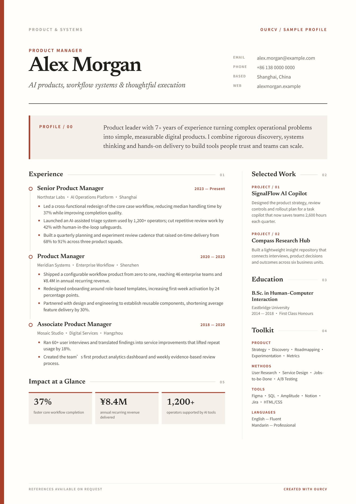

# OurCV

> 你的经历，你来落笔。

<p align="center">
  <a href="https://linkalling.github.io/ourcv/"><strong>在线体验</strong></a>
  ·
  <a href="https://github.com/linkalling/ourcv/releases/tag/v0.4.0"><strong>下载 v0.4.0</strong></a>
  ·
  <a href="https://github.com/linkalling/ourcv/issues"><strong>反馈问题</strong></a>
</p>

OurCV 是一个**隐私优先、无需登录、开箱即用**的静态简历编辑器。打开网页即可直接修改简历，文字和照片默认只保存在当前浏览器，不需要把求职信息上传到业务服务器。

项目由原生 HTML、CSS 和 JavaScript 构成，无需安装依赖或执行构建命令。下载后双击 `index.html` 即可使用，也可以直接部署到 GitHub Pages。

<p align="center">
  <a href="https://linkalling.github.io/ourcv/">
    
  </a>
</p>

<p align="center"><sub>英文双栏模板示例 · 点击图片进入在线编辑器</sub></p>

## 功能

- 🔒 **隐私优先**：简历正文与照片保存在当前浏览器。
- 🚪 **无需登录**：打开页面后直接编辑。
- 📝 **所见即所得**：直接在 A4 简历纸张上修改内容。
- 🧩 **双模板共用数据**：经典单栏与经典双栏自由切换。
- 🎨 **四套配色主题**：暖砂红、白灰、白蓝和白绿。
- ↕️ **模块化编辑**：支持经历增删、条目排序、栏目隐藏与恢复。
- 📐 **智能分页**：自动平衡内容密度与 A4 页数。
- 🖼️ **本地头像**：支持 JPG、PNG 和 WebP 格式的一寸照。
- 💾 **本地可迁移**：支持 JSON 备份、导入和一键清除。
- 📄 **多格式导出**：支持 PDF 与 PNG。

## 快速开始

### 方法一：直接使用

1. 下载项目并解压。
2. 双击 `index.html`。
3. 点击简历纸张上的文字开始编辑。
4. 点击“保存”进入最终预览。
5. 使用“导出 PDF”或“导出 PNG”生成文件。

### 方法二：启动本地静态服务

如果浏览器限制本地文件功能，可以在项目目录使用任意静态服务器，例如：

```bash
python -m http.server 8000
```

然后访问 `http://localhost:8000`。

## 模板

### 经典单栏

适合多数中文求职场景。工作经历、项目经历和教育经历按纵向排列，工作经历与项目经历可以互换顺序，项目经历可以暂时隐藏并随时恢复。

### 经典双栏

主栏呈现工作与教育经历，侧栏呈现项目经历与能力工具。支持调整侧栏宽度，项目经历和能力工具可以独立隐藏或恢复。

两套模板共用同一份数据，切换时不会丢失已填写内容。

## 本地数据与隐私

OurCV 的核心编辑流程不需要后端：

- 简历文字、偏好和头像通过 `localStorage` 保存在当前浏览器；
- 照片由浏览器在本地读取，不经过上传接口；
- JSON 备份直接下载到本机，导入过程也在本地完成；
- 清除浏览器站点数据会同时删除本地简历，请及时下载备份；
- 部署为网站后，托管服务仍可能记录 IP、访问时间、浏览器类型等基础访问日志，但这些日志不包含简历正文与照片。

PDF 和 PNG 导出使用随项目分发的固定版本 `html2canvas` 与 `jsPDF`，不需要从第三方 CDN 加载；如果组件加载失败，PDF 将回退到浏览器打印功能。第三方组件详见 [THIRD_PARTY_NOTICES.md](THIRD_PARTY_NOTICES.md)。

## 项目结构

```text
.
├── index.html
├── styles.css
├── app.js
├── assets/
│   ├── ourcv-mark.svg
│   ├── fonts/
│   └── vendor/
├── OurCV产品文档.md
├── CHANGELOG.md
├── THIRD_PARTY_NOTICES.md
└── LICENSE
```

## 部署到 GitHub Pages

1. 将本项目推送到 GitHub 公共仓库。
2. 进入仓库 `Settings → Pages`。
3. 在 `Build and deployment` 中选择 `Deploy from a branch`。
4. 选择 `main` 分支和根目录 `/ (root)`。
5. 保存并等待 GitHub 生成访问地址。

仓库中的 `.nojekyll` 用于按原样发布静态文件。

## 浏览器支持

建议使用较新的 Chrome、Edge、Firefox 或 Safari。由于简历和照片保存在浏览器本地，不同浏览器、设备和隐私模式之间不会自动同步。

## 开发

项目没有构建步骤，修改后刷新页面即可验证。

提交前建议至少检查：

```bash
node --check app.js
```

并手动验证：

- 单栏、双栏模板切换；
- 主题切换；
- 内容编辑和刷新恢复；
- 模块新增、删除、排序、隐藏和恢复；
- 图片上传；
- JSON 备份与导入；
- 智能分页；
- PDF 和 PNG 导出；
- 移动端基本可用性。

## 路线图

- [ ] 导入已有简历并自动结构化排版；
- [ ] 大模型简历评审与岗位匹配建议；
- [x] 完全本地化 PDF、PNG 导出依赖；
- [ ] 更多简历模块与语言；
- [ ] PWA 离线安装。

## 贡献

欢迎通过 Issue 提交问题、建议和模板需求。提交代码前，请尽量保持产品的三个原则：

1. 不强制注册；
2. 不上传简历正文和照片；
3. 不用复杂设置增加普通用户的使用门槛。

## 许可证

OurCV 源代码采用 [MIT License](LICENSE)。

字体及导出组件使用各自的开源许可证，详见 [THIRD_PARTY_NOTICES.md](THIRD_PARTY_NOTICES.md)。
